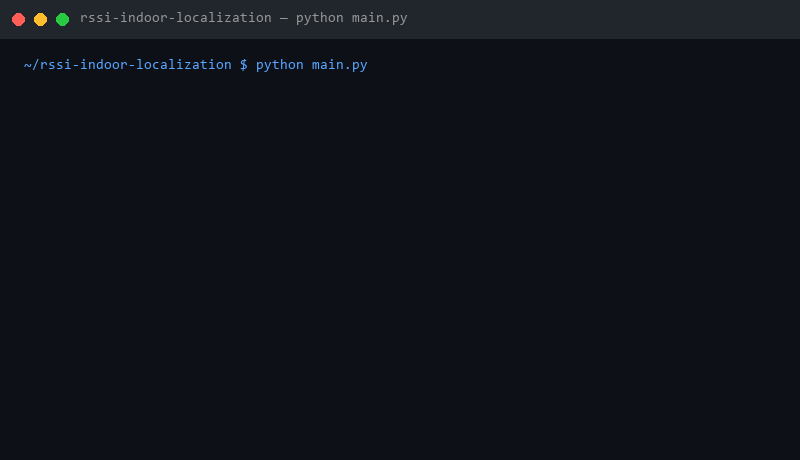
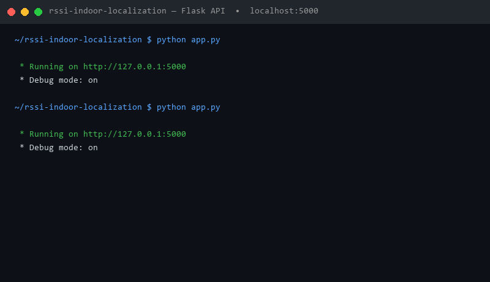
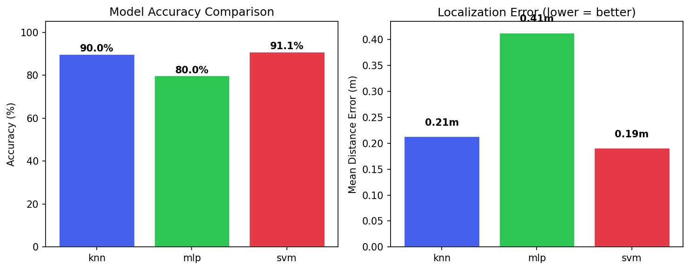
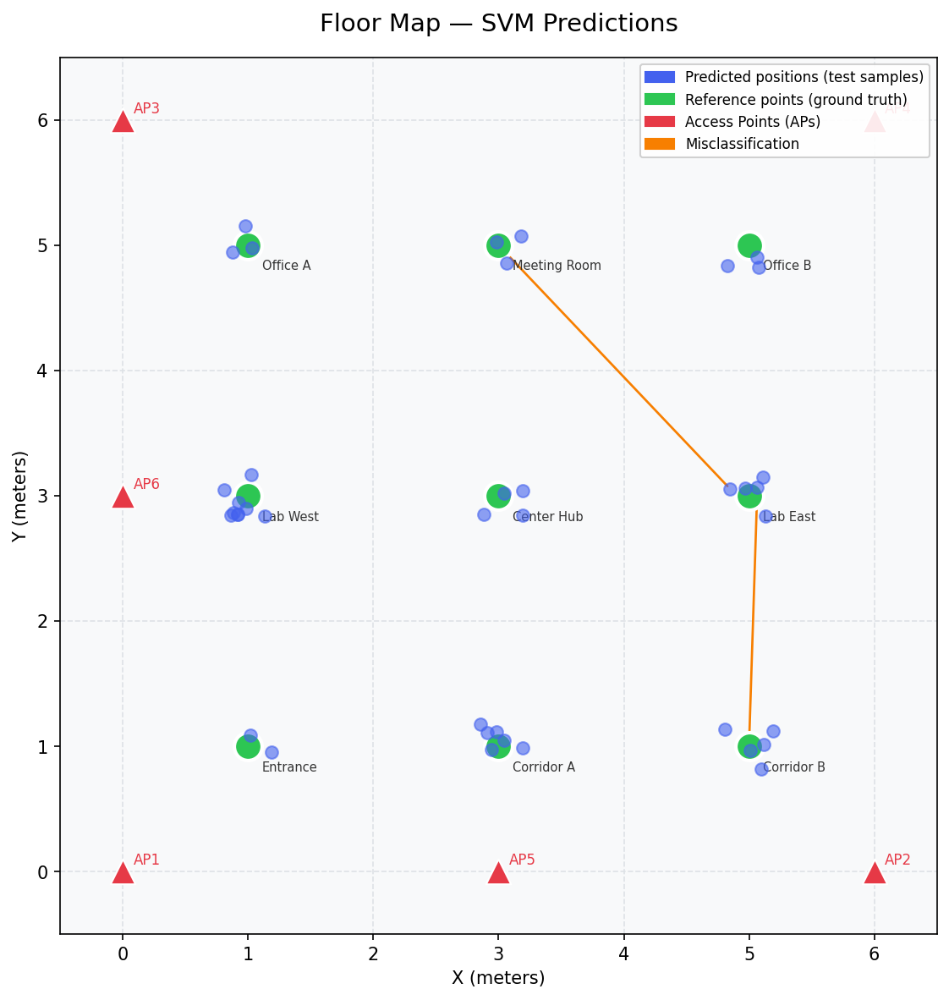
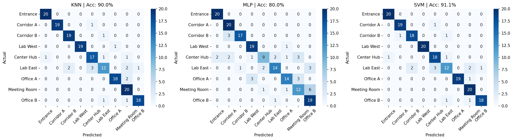

# RSSI-Based Indoor Localization

> Machine learning system that predicts indoor position from WiFi signal strength (RSSI) fingerprints using KNN, MLP, and SVM classifiers.

## Demo

### Training Pipeline (`python main.py`)


### Flask API in Action (`python app.py`)


---

## Results

| Model | Accuracy | Mean Distance Error |
|-------|----------|---------------------|
| KNN   | 90.0%    | 0.21 m              |
| MLP   | 80.0%    | 0.41 m              |
| SVM   | 91.1%    | 0.19 m              |

**Best model: SVM** — 91.1% accuracy with only 0.19 m average localization error.

---

## Model Accuracy & Localization Error



---

## Floor Map — Predicted vs Actual Positions



> Green dots = reference points (ground truth) · Blue dots = predicted positions · Orange arrows = misclassifications · Red triangles = Access Points (APs)

---

## Confusion Matrices (KNN · MLP · SVM)



---

## Project Structure

```
rssi-indoor-localization/
├── data/
│   ├── generate_dataset.py   # Standalone script to export dataset to CSV
│   └── rssi_dataset.csv      # Generated 900-sample RSSI fingerprint dataset
├── models/                   # Saved .pkl files (generated by main.py)
├── outputs/                  # Saved plots (generated by main.py)
│   ├── confusion_matrices.png
│   ├── floor_map.png
│   └── model_comparison.png
├── src/
│   ├── config.py             # All constants: floor layout, AP positions, paths
│   ├── dataset.py            # Synthetic RSSI data generation (path-loss model)
│   ├── train.py              # Trains KNN, MLP, SVM and saves .pkl files
│   ├── evaluate.py           # Accuracy, F1, and Mean Distance Error metrics
│   └── visualize.py          # Confusion matrices, floor map, comparison plots
├── app.py                    # Flask REST API for real-time prediction
├── main.py                   # Full pipeline: train → evaluate → visualize
└── requirements.txt
```

## How It Works

1. **Data**: Simulates RSSI readings from 6 Access Points at 9 reference locations using path loss model (FSPL). 100 samples per location with realistic Gaussian noise (σ = 3 dBm).
2. **Training**: Trains KNN, MLP Neural Network, and SVM on 80% of data (720 samples), evaluates on 20% (180 samples).
3. **Evaluation**: Reports Accuracy, F1 score, and Mean Distance Error (meters) — a domain-specific metric measuring physical localization accuracy.
4. **API**: Flask REST API for real-time prediction from raw RSSI values.

## Setup

```bash
pip install -r requirements.txt
python main.py        # Train and evaluate all models + save plots
python app.py         # Start the Flask API (port 5000)
```

## API Usage

```bash
# Predict location from 6 RSSI values (one per Access Point)
curl -X POST http://localhost:5000/predict \
  -H "Content-Type: application/json" \
  -d '{"rssi": [-60, -55, -70, -65, -50, -75]}'

# List all reference locations
curl http://localhost:5000/locations
```

Example response:
```json
{
  "predicted_location_id": 4,
  "predicted_location_name": "Center Hub",
  "confidence": 80.0,
  "all_probabilities": {
    "Entrance": 0.0,
    "Corridor A": 0.0,
    "Center Hub": 80.0,
    "...": "..."
  }
}
```

## Tech Stack

Python · scikit-learn · Flask · pandas · matplotlib · seaborn

## Background

RSSI fingerprinting is a core technique in indoor localization, widely used where GPS is unavailable (hospitals, warehouses, shopping malls). This project implements the full pipeline:

- **Data generation** using the Free-Space Path Loss (FSPL) model with realistic noise
- **Feature engineering**: 6-dimensional RSSI vector (one per AP), standardized
- **Model comparison**: KNN (non-parametric), MLP (neural network), SVM (kernel method)
- **Domain metric**: Mean Distance Error in meters, more meaningful than raw accuracy for localization tasks
- **REST API**: production-ready Flask endpoint for integration with real sensor systems
